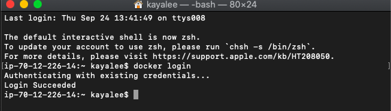

# ⛴ Docker로 MariaDB 사용하기 (Mac ver)

[목표]

- 도커 허브로 이미지 다운받기
- 도커 커멘드로 마리아디비 연결하기

<br>

### 도커 설치

> - 도커 이미지를 다운받아 설치하기 위해서는 먼저 도커를 설치해야함
> - 도커 허브까지 가입해서 로그인하기~!

<br>

#### > Docker install

- 도커 설치하기

> https://docs.docker.com/docker-for-mac/install/

<br>

- 도커 허브 회원가입 및 로그인

> https://hub.docker.com/

<br>

#### > Docker Login

- 도커 허브 아이디, 비밀번호로 로그인

`docker login`

<br>



<br>

#### > 도커 허브에서 MariaDB image pull

> https://hub.docker.com/_/mariadb

<br>

- MariaDB pull

`docker pull mariadb`

<br>

#### > MariaDB docker run

> - 받은 도커 이미지를 실행시키기

<br>

- 터미널 창

```bash
$ docker run --name [프로젝트명]-mariadb -e MYSQL_ROOT_PASSWORD=[password] -d mariadb:[tag]
```

예시 > `docker run --name my-mariadb -e MYSQL_ROOT_PASSWORD=root -d mariadb:latest`

<br>

#### > MariaDB 실행

`$ docker exec -it [프로젝트명]-mariadb bash`

<br>

[터미널 실행 환경]

```bash
ip-70-12-226-14:~ kayalee$ docker exec -it some-mariadb bash
root@9e828e1814f5:/# mysql
```

[리눅스 명령어로 잘 실행되나 확인 : ls]

```bash
root@9e828e1814f5:/# ls
bin  boot  dev  docker-entrypoint-initdb.d  etc  home  lib  lib32  lib64  libx32  media  mnt  opt  proc  root  run  sbin  srv  sys  tmp
```

<br>

[mysql 로그인]

```bash
root@9e828e1814f5:/# mysql -u -root -p
Enter password: [위에서 설정한 패스워드 입력]

Welcome to the MariaDB monitor.  Commands end with ; or \g.
Your MariaDB connection id is 19
Server version: 10.5.5-MariaDB-1:10.5.5+maria~focal mariadb.org binary distribution

Copyright (c) 2000, 2018, Oracle, MariaDB Corporation Ab and others.

Type 'help;' or '\h' for help. Type '\c' to clear the current input statement.
```

<br>

#### > Mysql 명령어 입력

> - 제대로 디비가 잘 돌아가는지 확인

```bash
MariaDB [(none)]> show databases;
+--------------------+
| Database           |
+--------------------+
| information_schema |
| mysql              |
| performance_schema |
+--------------------+
3 rows in set (0.009 sec)
```

<br>

#### > 명령어 예시

```bash
@bash$mysql -u root -p
Enter Password : password
mysql>show databases;    //mysql shell에서 databases 확인
mysql>use mysql;         //mysql db 사용
mysql>quit;              //mysql shell 종료
@bash$exit;              //bash shell 종료l

#database 생성
mysql>create database mcdb default character set 'utf8';
mysql>use mcdb

#user 생성 권한설정
# mcadmin user생성 모든 데이터베이스 및 안에 테이블에 관하여 모든 권한 제공
mysql>grant all privileges on *.* to 'mcadmin'@'%' identified by 'password';
myslq>grant select,insert,update,delete on mcdb.* to 'mcadmin'@'%';
#권한저장
mysql>flush privileges;
#사용자 조회 삭제
mysql>SELECT host, user FROM mysql.user;
mysql>DROP USER 'mcadmin'@'%';
mysql>grant all privileges on *.* to 'mcadmin'@'%' identified by 'password';
mysql>flush privileges;

mysql -u mcadmin -p
Enter password:password
mcadmin>use mysql;
```

<br>
<br>
