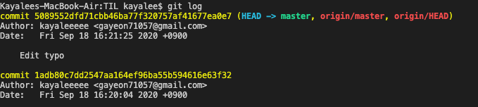

# Commit 되돌리기 & 삭제하기

> 이미 깃허브에 커밋한 내용을 되돌리고 싶을때~!
> git log과 github의 커밋 내용 삭제하기

 

### 1. 깃 로그 확인 `git log`

- 삭제하고자 하는 깃 로그 확인하기

 

### 2. 가장 최근의 git commit 삭제 `git reset HEAD^`

- `git reset HAED~2`: 최근 커밋 2개 삭제
- `git reset [커밋 명]` : 지정한 커밋 삭제

 

### 3. Github 원격저장소의 내용도 삭제

- `git push -f origin [브랜치명]` 원격 저장소에 -f로 푸시
