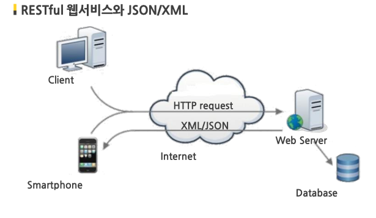
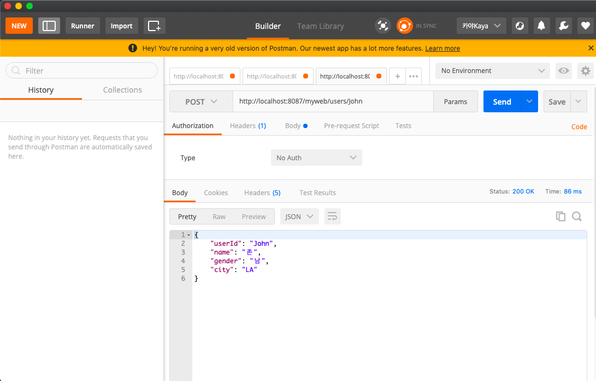

# 📩 RESTful API 사용하기 📬

[목표]

- RESTful하게 웹 페이지 url을 설정하기
- JSON 데이터에 접근하여 CRUD 실행하기

<br>

### REST (REpresentational State Transfer)이란?

> - **HTTP URI + HTTP Method**
> - HTTP URI를 통해 제어할 리소스를 명시하고, HTTP Method(GET, POST, PUT, DELETE)를 통해 해당 리소스를 제어하는 아키텍쳐
> - HTTP 프로토콜에 정의된 POST, GET, PUT, DELETE가 각각 CRUD 오퍼레이션 정의

**URI(Uniform Resource Identifier)란?** 인터넷 자원의 위치 즉 파일의 위치를 나타내는 유일한 주소 (URL, URL을 통칭하는 개념)

<br>

### RESTful API란?

> - REST의 원리를 따르는 API
> - 각 요청이 어떤 동작이나 정보를 위한 것인지 명시적으로 알 수 있게 함
> - HTTP와 URI기반으로 자원에 접근할수 있도록 제공하는 어플리케이션 개발 인터페이스
> - 일관성있게 액션과 리소스 정보를 나타낼 수 있음

<br>

[글 번호가 510이고 이름이 java인 게시글을 지우는 방법 비교]

| 기존 웹 접근방식                  | RESTful API                         |
| --------------------------------- | ----------------------------------- |
| url : /delete.do?no=510&name=java | url : /bbs/java/510                 |
| -GET / POST 방식만으로 CRUD 표현  | GET/POST/PUT/DELETE 매소드 모두사용 |
| URI: 액션을 나타냄                | URI : 처리하려는 자원 나타냄        |

<br>

### Open API란?

> - 어플리케이션 개발시 사용할 수 있도록 제공되는 개방형 API
> - 대부분의 Open API는 REST 방식으로 지원
> - **API (Application Programing Interface) ?** 프로그램 개발 시 사용하는 인터페이스로 서버와 DB에 접근할 수 있는 출입구 역할을 함

<br >

### JSON이란?

> - Javascript Object Notation
> - 조금 더 쉽고 가볍게 데이터를 교환할 수 있는 형식
> - 자바스크립트에서 객체를 만들 때 사용하는 표현식 사용 {key: value}
> - 사람과 기계 모두 이해하기 쉽고 용령이 작아서 XML 대체로 많이 이용됨
> - 특정 언어에 종속되지 않고 대부분의 프로그래밍언어에서 JSON 데이터를 핸들링할 수 있는 라이브러리를 제공

<br>

[JSON 데이터 예시]

```javascript
{
    "userId": "Lee",
    "name": "hyori",
    "gender": "F",
    "city": "Jeju"
}

```



<br><br>

### 🧺 Spring MVC 기반으로 RESTful 웹 서비스 구현하기

#### 0. 환경설정하기

> 1. mvc:default 값을 설정해줘서 바꾼 DispatcherServlet의 url-pattern와 충돌이 나지 않도록 함
> 2. JSON과 XML데이터를 읽고 쓰는 것을 내부적으로 처리하는 annotaion-driven설정
> 3. Jackson 설치: JSON 형태를 자바객체로 / 자바를 JSON 형태로 바꿔주는 자바 라이브러리

<br>

**[pom.xml]** jackon의존성 추가

```xml
<!-- https://mvnrepository.com/artifact/com.fasterxml.jackson.core/jackson-databind -->
<dependency>
	<groupId>com.fasterxml.jackson.core</groupId>
	<artifactId>jackson-databind</artifactId>
	<version>2.11.2</version>
</dependency>

```

```xml
	<!-- DispatcherServlet의 url-pattern충돌 문제 해결 -->
	<mvc:default-servlet-handler/>
	<!-- JSON, XML Data read/write support -->
	<mvc:annotation-driven />
```

**[web.xml]**

> - RESTful한 구성을 위해 [web.xml]의 DispatcherServlet url-pattern을 변형

[이전 web.xml]

```xml
  <servlet-mapping>
    <servlet-name>springDispatcherServlet</servlet-name>
    <url-pattern>*.do</url-pattern>
  </servlet-mapping>
```

[바꾼 web.xml]

```xml
  <servlet-mapping>
    <servlet-name>springDispatcherServlet</servlet-name>
    <url-pattern>/</url-pattern>
  </servlet-mapping>
```

<br>

#### 1. RESTful 웹 서비스를 처리할 Controller 클래스 작성

| 어노테이션      | 기능                                                                                                                                                           |
| --------------- | -------------------------------------------------------------------------------------------------------------------------------------------------------------- |
| @RestController | - @Controller와 @Responsebody의 기능을 합쳐놓은 것                                                                                                             |
| @RequestBody    | - HTTP 요청 body를 자바객체로 전달 받음 <br> - 인자를 body형태로 받아오기 때문에 POST형태로만 사용 <br> - Jackson이 전달받은 객체를 JSON으로 변환해서 내보내줌 |
| @RequestMapping | - HTTP 요청을 처리할 매소드를 매핑해줌 <br > - 클래스, 매소드 위에 사용 가능                                                                                   |
| @GetMapping     | - Get 요청을 처리 할 매소드를 매핑 <br> - @RequestBody와 같은 역할이지만 매소드 위에만 사용 가능                                                               |
| @PostMapping    | - Post 요청을 처리할 매소드 매핑                                                                                                                               |
| @PutMapping     | - Put 요청 (update)처리할 매소드 매핑                                                                                                                          |
| @DeleteMapping  | - Delete 요청 처리할 매소드 매핑                                                                                                                               |
| @PathVariable   | - 파라미터를 URL 내에 사용할 수 있는 형식으로 받아줌                                                                                                           |

<br>

[RESTUserController.java]

```java

@RestController
public class RESTUserController {

		@Autowired
		private UserService userService;

		@RequestMapping("/users/{userid}")

		//받아올 인자값이 String userid로 이름을 맞추지 않으면 @PathVariable(설정한 이름)로 맞춰줘야함
		public UserVO getUser(@PathVariable String userid) {
			UserVO user = userService.getUser(userid);
			return user;
		}

		@GetMapping("/users")
		public List<UserVO> getUsers(){
			 List<UserVO> userList = userService.getUserList();
			 return userList;
		}

		@PostMapping("/users")
		public Boolean insertUser(@RequestBody UserVO user) {
			if(user !=null) {
				userService.insertUser(user);
				return Boolean.TRUE;
			}else {
				return Boolean.FALSE;
			}
		}

		@PutMapping("/users")
		public Boolean updateUser(@RequestBody UserVO user) {
			if(user!=null) {
				userService.updateUser(user);
				return Boolean.TRUE;
			}else {
				return Boolean.FALSE;
			}

		}

		@DeleteMapping("/users/{id}")
		public Boolean deleteUser(@PathVariable("id") String userid) {
			if(userid!=null) {
				userService.deleteUser(userid);
				return Boolean.TRUE;
			}else {
				return Boolean.FALSE;
			}
		}
}

```

<br>

#### 2. RESTful하게 데이터를 읽어오는지 확인

[유저 리스트 전체 받아오기]

```java
@GetMapping("/users")
    public List<UserVO> getUsers(){
	List<UserVO> userList = userService.getUserList();
	return userList;
}
```


<br>

[특정 유저 받아오기 ]

```java
@RequestMapping("/users/{userid}")
    public UserVO getUser(@PathVariable String userid) {
	UserVO user = userService.getUser(userid);
	return user;
}
```


<br>

#### 3. REST Client Tool(Postman)사용, 각각의 매서드 테스트

> - Postman : JSON 데이터를 쉽게 핸들링할수 있는 응용 프로그램
> - 개발한 API를 테스트하고 그 결과를 공유하여 API 개발의 생산성을 높여줌
>   [주소 클릭](https://www.postman.com/downloads/)

<br>

[설정한 RESTful API 바로 CRUD 가능]


<br>
