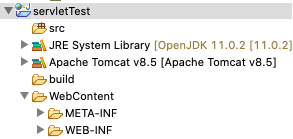
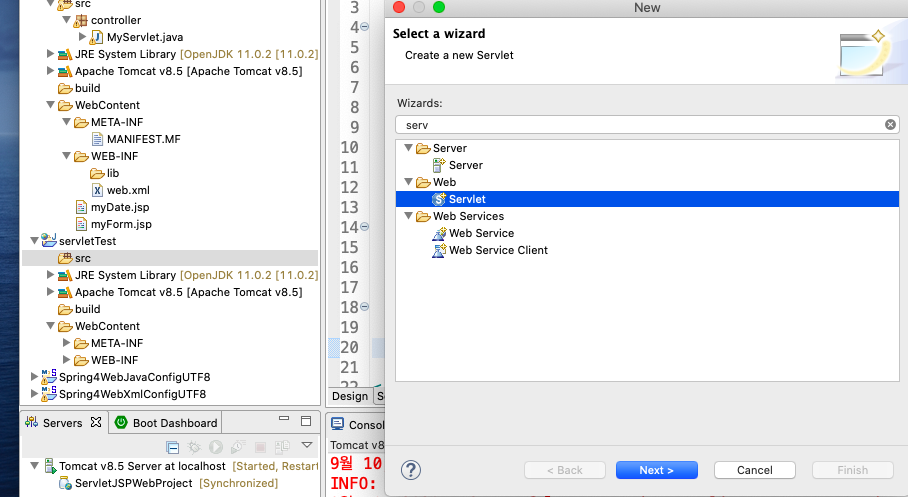
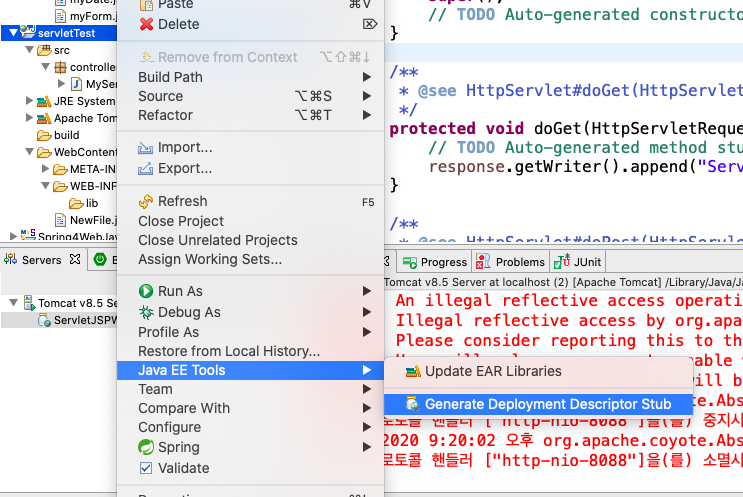
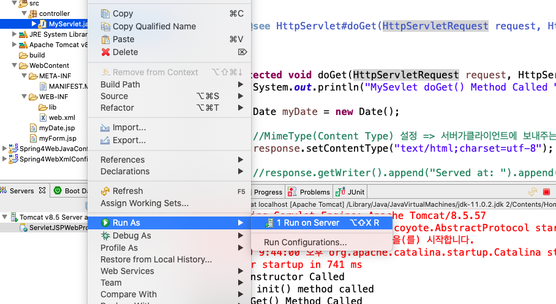
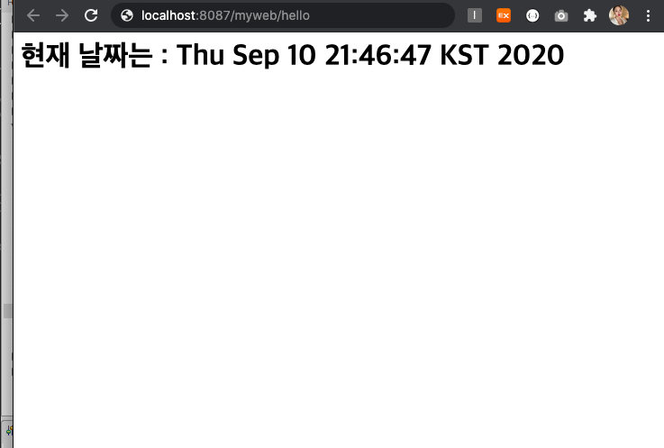
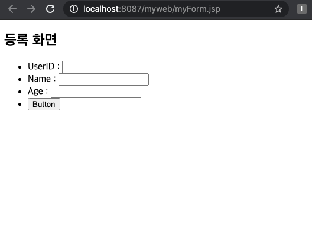

# 🔗 Servlet 서블릿 & JSP ⚙️

> - 동적인 처리가 가능한 웹 어플리케이션을 만들 수 있는 라이브러리
> - Java 언어를 기반으로 작성되어 서버사이드에서 동작함
> - 서블릿 등장 후 JSP 등장
> - WAS의 웹 컨테이너 역할을 함

<br>

### Servlet 서블릿이란?

> - 웹에서 들어온 요청에 따라 동적인 처리가 가능하도록 구성된 클래스
> - Java 코드 안에 HTML코드를 넣어서 작성함
> - DB와 통신하고 비지니스 로직과 데이터를 관리하는 작업에 유용
> - 클래스이기 때문에 코드 수정이 생길때 마다 새로 컴파일을 해줘야함

<br>

### JSP(Java Server Pages)란?

> - HTML코드 안에 Java코드를 넣어서 작성하는 스크립트 언어
> - JSP를 통해 HTML과 사용자가 입력한 데이터 (http request)와 같은 동적인 데이터를 함께 사용 할 수 있음
> - JSP 실행 시 WAS에서 JSP를 서블릿으로 자동 변환함
>   Tomcat(WAS)의 내장 객체 사용 가능 (response, session, out, applicaion)

<br>
 
  
   Servlet 혹은 JSP만 단독으로 쓰면  각각의 단점들이 너무 명확하게 보이기 때문에 <br> 보통 **Servlet은 Controller / JSP는 View** 역할을 하도록 구성하는 것이 일반적

<br><br>

### 🛠 서블릿 사용하기

1. 서블릿과 JSP를 사용할 프로젝트 생성



2. 생성한 프로젝트 src에 서블릿 생성



3. web.xml 설정
   > - Deployment Descriptor(DD) 역할
   > - 서블렛 설정해주는 파일



[web.xml]

```xml
  <!-- MySevlet Class 설정 -->
  <servlet>
        <!-- 서블렛파일 이름 -->
   	<servlet-name>MyServlet</servlet-name>
        <!-- 서블렛파일 위치한 패키지 설정 -->
   	<servlet-class>controller.MyServlet</servlet-class>
  </servlet>

  <servlet-mapping>
  	<servlet-name>MyServlet</servlet-name>
        <!-- Web에 띄워줄 url 설정 -->
  	<url-pattern>/hello</url-pattern>
  </servlet-mapping>
</web-app>
```

4. Servlet.java에 코드 작성
   > - @WebServlet()을 통해 web.xml에 설정된 url-pattern을 매핑
   > - response.setContentType()를 통해 content 타입을 먼저 명시 해줌
   > - PrintWriter타입 객체를 생성하여 문자열을 처리할 Stream생성

```java
@WebServlet("/hello")
public class MyServlet extends HttpServlet {
	private static final long serialVersionUID = 1L;

    public MyServlet() {
        super();
        System.out.println("MySevlet Constructor Called");
    }

// doGet 매소드를 통해 웹 화면에 띄워줄 요소들 작성
	protected void doGet(HttpServletRequest request, HttpServletResponse response) throws ServletException, IOException {
		System.out.println("MySevlet doGet() Method Called ");

		Date myDate = new Date();
		//MimeType(Content Type) 설정 => 서버가클라이언트에 보내주는 타입을 알려줌
		response.setContentType("text/html;charset=utf-8");

		//Character(문자열)을 처리하는 Stream 생성하기
		PrintWriter writer = response.getWriter();

		writer.println("<html><body><h1> 현재 날짜는 : " + myDate + "</h1>");
		writer.println("</body></html>");

		writer.close();
	}
}
```

5. 서버로 돌려보기




<br><br>

### 🔧 JSP 사용하기

> 서블릿으로 배포한 결과와 같도록 설정해보기~!

1. 프로젝트의 WebContent 아래에 JSP파일 생성
   

2. myWeb.jsp
   > - selvet 파일에서 설정해준 콘텐츠 파일을 상단에 명시
   > - 자바코드를 사용시 <% %>안에 입력

```java
<%@page import="java.util.Date"%>

        // selvet.java에서 설정해준 contentType 여기에 설정
<%@ page language="java" contentType="text/html; charset=UTF-8"
    pageEncoding="UTF-8"%>
<!DOCTYPE html>
<html>
<head>
<!-- <meta charset="UTF-8"> -->
<title>Insert title here</title>
</head>
<body>
<%-- //자바코드 넣는 법 <% %> --%>
	<% Date myDate = new Date(); %>
	<h1>현재 날짜는 : <% out.println(myDate); %></h1>
	<h2>현재 날짜는 : <%=myDate %></h2>
</body>
</html>
```

3. url 다시 매핑

- web.xml에서 \*.do로 다시 mapping (.do로 끝나는 모든 url 사용 가능)
- selvet.java 파일에서 @Webservlet 지워줌

```xml
<!-- XML 파일 -->
  <servlet-mapping>
  	<servlet-name>MyServlet</servlet-name>
	<url-pattern>*.do</url-pattern>
  </servlet-mapping>
```

```java

// @WebServlet("/hello")
public class MyServlet extends HttpServlet {
	private static final long serialVersionUID = 1L;

```

4. 서블릿과 데이터를 주고받는 코드 짜보기 [myForm.jsp]

> - HTML의 form과 input 태그를 이용해 입력값을 전달하도록 함
> - input name을 통해 servlet 파일에서 인자를 넘겨받을 수 있도록 설정

```java
<%@ page language="java" contentType="text/html; charset=UTF-8" pageEncoding="UTF-8"%>
<!DOCTYPE html>
<html>
<head>
<meta charset="UTF-8">
<title>Insert title here</title>
</head>
<body>

<h2>등록 화면</h2>
<form method="get" action="hello.do">
    <ul>
	<li>UserID : <input type="text" name="userId"></li>
	<li>Name : <input type="text" name="firstName"></li>
        <li>Age : <input type="number" name="age"></li>
        <li><input type="submit" value="Button"></li>
    </ul>
</form>
</body>
</html>
```

[서버를 돌린 웹 화면]


5. Sevlet 파일 doPost에서 4번 input태그에서 받아온 값 뿌려주기

```java
protected void doPost(HttpServletRequest request, HttpServletResponse response) throws ServletException, IOException {

    //요청데이터에 대한 한글 인코딩은 getParameter전에 해줘야함.
    request.setCharacterEncoding("utf-8");

    //Form input Data 추출
    //getParameter()는 무조건 문자로 넘어옴;
	String userId = request.getParameter("userId");
	String name = request.getParameter("firstName");
	String tmpAge = request.getParameter("age");

	//String -> number (String == Not Null)
	int age = Integer.parseInt(tmpAge) + 10;

	//Render result on web browser
	response.setContentType("text/html;charset=utf-8");

	PrintWriter out = response.getWriter();

	out.println("<h2>UserID : " + userId + "</h2>");
	out.println("<h2>Name : " + name + "</h2>");
	out.println("<h2>Age: " + age + "</h2>");

	out.close();
}
```
