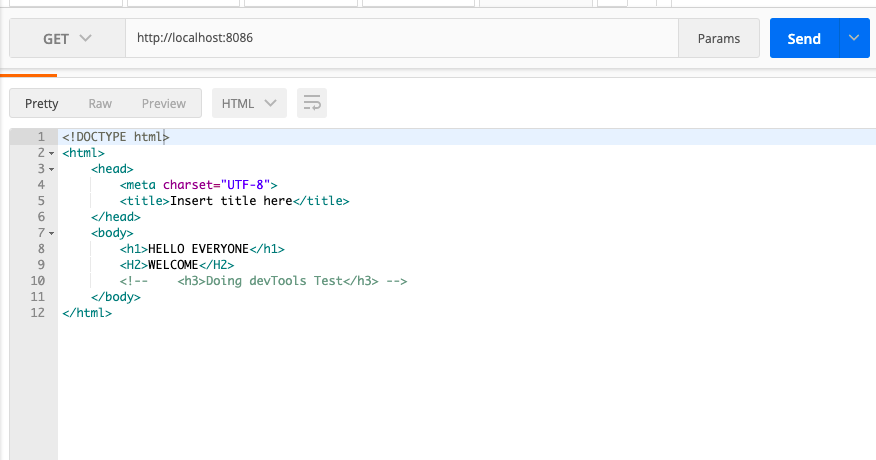
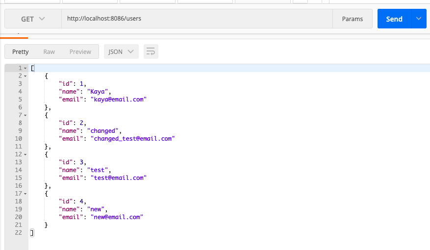
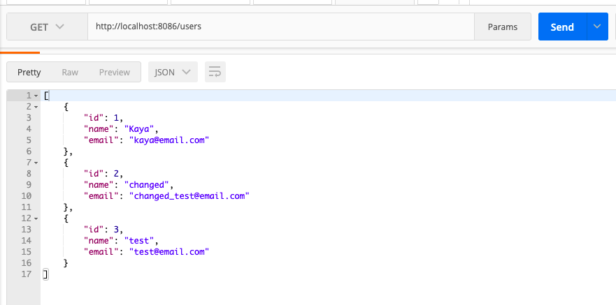

# 🏋️‍♀️ Web MVC 만들기

### Spring Boot 스프링부트 Web MVC

> - **개발자가 하지 않아도 자동으로 Spring MVC 설정을 해줌**
>   spring-boot-autoconfigure.jar / META-INF 디렉토리 내에 spring.factories의 org.springframework.boot.autoconfigure.web.servlet.**WebMvcAutoConfiguration**에서 WebMvc와 관련된 클래스가 자동 설정
> - **스프링 MVC 확장 제공**
>   @Configuration + WebMvcConfigurer 인터페이스 구현

<br> <br>

### Restful Web 구축하기

#### 1. User 클래스 생성 / Entity로 등록

[User.java]

```java


@Entity
public class User {
	@Id @GeneratedValue(strategy = GenerationType.IDENTITY)
	private Long id;

	@Column
	private String name;

	@Column(unique=true)
	private String email;


	public Long getId() {
		return id;
	}

	public void setId(Long id) {
		this.id = id;
	}

	public String getName() {
		return name;
	}

	public void setName(String name) {
		this.name = name;
	}

	public String getEmail() {
		return email;
	}

	public void setEmail(String email) {
		this.email = email;
	}
}
```

<br>

#### 2. Repository 등록

[UserRepository.java]

```java
public interface UserRepository extends JpaRepository<User, Long> {
	Optional<User> findByEmail(String email);
}
```

<br>

#### 3. RestController작성 (JSON)

[ 어노테이션을 통한 HTTP 메세지와 객체 매핑]

[ 🔖 Restful 어노테이션 보기](./Spring/spring_mvc.md)

**@RequestBody**

- JsonMessageConverter
- HTTP 요청 본문을 Json객체로 변경하거나, Json객체를 HTTP 응답 본문으로 변경할 때는 JsonMessageConverter 사용
- {"username":"vega2k", "password":"123"} <-> User
- Controller에서 ContentNegotiatingViewResolver를 통해 객체를 자동적으로 json 형식으로 데이터를 반환

<br>

**@ResponseEntity**

- 모든 HTTP response를 나타낼 수 있는 객체 (status code, headers, body)
- 앤드포인트에 결과값을 보여줌 (나머지는 스프링이 처리)
- Generic Type이라 어떤 타입이던 리턴 가능
- 참조 https://www.baeldung.com/spring-response-entity

<br>

```java
@RestController
public class UserRestController {

	@Autowired
	private UserRepository userRepo;

    // 유저 생성
	@PostMapping("/users")
	public User create(@RequestBody User user) {
		return userRepo.save(user);
	}

    // 유저 조회
	@RequestMapping(value = "/users/{id}")
	public User getUser(@PathVariable Long id) {
		Optional<User> optional = userRepo.findById(id);
		return optional.orElseThrow(() -> new ResourceNotFoundException("User", "id", id));
	}

    // 전체 유저 조회
	@RequestMapping(value = "/users", produces = { "application/json" })
	public List<User> getUsers() {
		return userRepo.findAll();
	}

    // 유저 삭제
	@DeleteMapping("/users/{id}")
	public ResponseEntity<?> deleteUser(@PathVariable Long id) {

	Optional<User> optional = userRepo.findById(id);
	    //ID와 매핑하는 유저가 없는 경우
	    if(optional.isEmpty()) {
		return new ResponseEntity<>("요청한 ID 존재하지 않습니다. ",HttpStatus.NOT_FOUND);
	    }

	    //실제 DB삭제
	    userRepo.deleteById(id);
	    return new ResponseEntity<>(id+ "삭제가 완료되었습니다. ", HttpStatus.OK);
	}

    // 유저 정보 변경
	@PutMapping("/users/{id}")
	public User updateUser(@PathVariable Long id, @RequestBody User userDetail) {
		User user = userRepo.findById(id).orElseThrow(() -> new ResourceNotFoundException("User", "id", id));
		user.setName(userDetail.getName());
		user.setEmail(userDetail.getEmail());
		User updatedUser = userRepo.save(user);
		return updatedUser;
	}
}
```

<br>

#### 4. 사용자 정의 Exception 만들기 : ResoueceNotFoundException

<br>

[ ResourceNotFoundException.java]

```java
@ResponseStatus(value= HttpStatus.NOT_FOUND)
public class ResourceNotFoundException extends RuntimeException{

	private String resourceName;
	private String fieldName;
	private Object fieldvalue;

	public ResourceNotFoundException(String resourceName, String fieldName, Object fieldvalue) {
		super(String.format("%s not found with %s : '%s'", resourceName, fieldName, fieldvalue));
		this.resourceName = resourceName;
		this.fieldName = fieldName;
		this.fieldvalue = fieldvalue;
	}

	public String getResourceName() {
		return resourceName;
	}

	public String getFieldName() {
		return fieldName;
	}

	public Object getFieldvalue() {
		return fieldvalue;
	}
```

<br><br>

### Postman으로 json 데이터 다루기

#### >> postman 접속

https://www.postman.com/

<br>

**[1. 인덱스 페이지 Get으로 연결 확인]**



<br>

**[2. Post로 localhost:8086/users에서 user 넣기]**

> 1. 캡처에는 url이 users/1로 되어있지만 contoller.java에서 설정한 대로 /users로만 접속해야 포스트 됨


<br>

> 2. 삽입할 JSON 데이터 넣어주기


<br>

**[3. 전체 유저 받아오기]**



<br>

**[4. users/id값으로 connect해서 설정 값 변경해주기]**


<br>

**[5.Delete로 유저 삭제하기]**

> 1. users/삭제할 유저 id로 삭제


> 2.  존재하지 않는 유저id로 delete 요청 할 경우


> 3. 다시 전체 유저 조회



<br>
